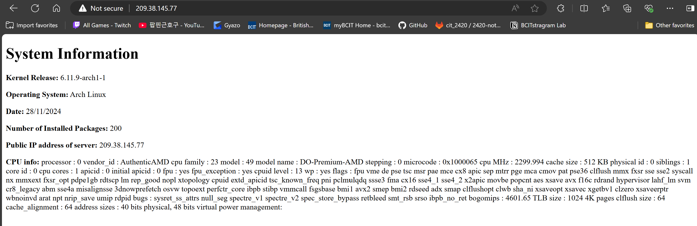

# 2420-assignment-3
## Table of Contents
1. [Introduction](#introduction)
2. [Instructions](#instructions)
3. [Web Server Result](#web-server-result)
4. [Update index.html](#update-indexhtml)

## Introduction
This is an Linux assignment where I have to create a web server by setting up a bash script that generates a static `index.html` file containing system information that will automatically run every day at 5:00 AM. Then displaying the `index.html` on a web server hosted on your Arch Linux droplet using Nginx. Additionally, it includes a `ufw` firewall configuration for system security.

In this repository, you will find a bash script named `setup` that will create a system user name webgen and automatically set up all the files for the web server to work.

The reason we create a system user is beacause we want to make it run scripts and services only and prevent it from making system changes.

## Instructions
### 1. System update
To start off, make sure you have the latest version of Linux. If not use the following command to install the latest version:
```
sudo pacman -Syu
```
Then reboot your system.
```
sudo systemctl reboot
```
### 2. Clone repository
Clone this repository into your home directory.
Use the following command to clone the repository:
```
https://github.com/Abungo-w/2420-assignment-3.git
```
### 3. Run the setup bash script
Then go into the new directory you just cloned named `2420-assignment-3` and run the file named `setup`.
Use the following command to run the setup file:
```
sudo ./setup
```
> **_NOTE:_**  The setup might fail if you don't have your linux system up to date. Make sure to update it and reboot before you run the setup file!
### 4. Test if setup is complete
Check if the timer service is active and that the service runs successfully:
```
sudo systemctl status generate-index.timer
```
Check logs and to confirm the service's execution:
```
sudo journalctl -u your-service.service
```
Check the status of the nginx services.
```
sudo systemctl status nginx
```
Test the nginx configuration for syntax errors
```
sudo nginx -t
```
Check the status of your firewall
```
sudo ufw status verbose
```

## Web Server Result
This is what the webpage should look like when you enter your Arch Linux droplet IP address on a web browser.


## Update index.html 
If everything is setup correctly, we can futher improve `generate_index` script to include additional system information.
All you need to do is edit the file with a text editor like `neo vim`:
```
sudo nvim /var/lib/webgen/bin/generate_index
```
For example, if you want to add and display cpu info, add this line into the `generate_index` script.
```
cpu=$(cat /proc/cpuinfo)
```
- `cat` reads the /proc/cpuinfo file where all the cpu info is stored, then storing it in a variable call cpu

Then add a new line that calls the variable into the html body:
```
<p><strong>CPU info:<strong> $cpu</p>
```
It should look something like this:

> **_NOTE:_**This is just an example. You can format it and get specific cpu info or other system info to make it look better!


