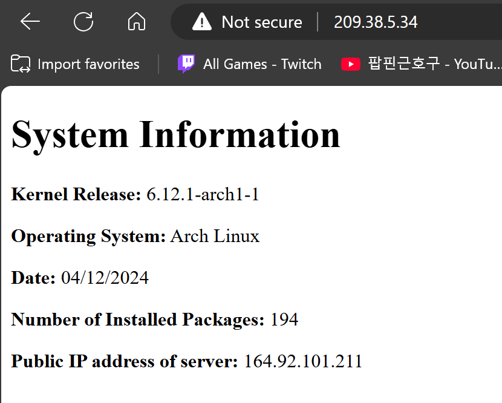
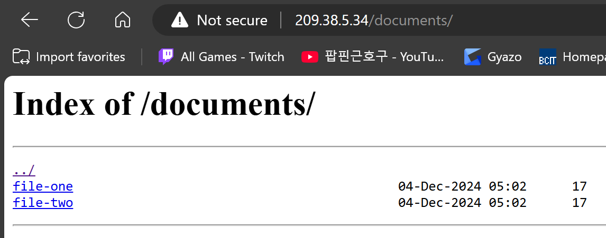

# 2420-assignment-3-part-2
## Table of Contents
1. [Introduction](#introduction)
2. [Creating the Load Balancer](#creating-the-load-balancer)
3. [Setting Up the Servers](#setting-up-the-servers)
4. [Web Server Result](#web-server-result)

## Introduction
This is Linux assignment 3 part 2 where I have to set up a bash script that generates a static `index.html` file containing system information on two new Arch Linux droplets. The script will automatically run every day at 5:00 AM. Then using Nginx to display the `index.html` on the web server and two downloadable test file on the file server hosted by the two new Arch Linux droplet with a load balancer. Additionally, it includes a `ufw` firewall configuration for system security.

In this repository, you will find a bash script named `setup` that will create a system user name webgen and automatically set up all the files for the web server to work.

The reason we create a system user is beacause we want to make it run scripts and services only and prevent it from making system changes.

## Creating the Load Balancer
1. go to digital ocean and log in to your account
2. Create two new Arch Linux droplets for the load balancer with a web tag.
3. Click Load Balancers in the Create dropdown menu.
Use the following settings for the load balancer:
- Regional
- datacenter region: SFO3 (same as the servers)
- Default VCP
- External (Public)
- Connect Droplets: use the `web` tag
4. Click Create Load Balancer.

## Setting Up the Servers
> **_NOTE:_** You need to set up the web server on both of your new Arch Linux droplet!
### 1. System update
To start off, make sure you have the latest version of Linux on your two new droplets. If not, use the following command to install the latest version:
```
sudo pacman -Syu
```
Then reboot your system
```
sudo systemctl reboot
```
### 2. Clone repository
Before you clone the repository, you need to install git on your two new Arch Linux droplets.
```
sudo pacman -S git
```
Clone this repository into your home directory.
Use the following command to clone the repository:
```
git clone https://github.com/Abungo-w/2420-assignment3-p2.git
```
### 3. Run the setup bash script
Then go into the new directory you just cloned named `2420-assignment3-p2` and run the file named `setup`.
Use the following command to run the setup file:
```
sudo ./setup
```
> **_NOTE:_**  The setup might fail if you don't have your linux system up to date. Make sure to update it and reboot before you run the setup file!


## Web Server Result
This is what the webpage should look like when you enter your load balancer IP address on a web browser.


This is what your file server should look like when you enter `<your-load-balancer-IP-address>/documents` on a web browser.


